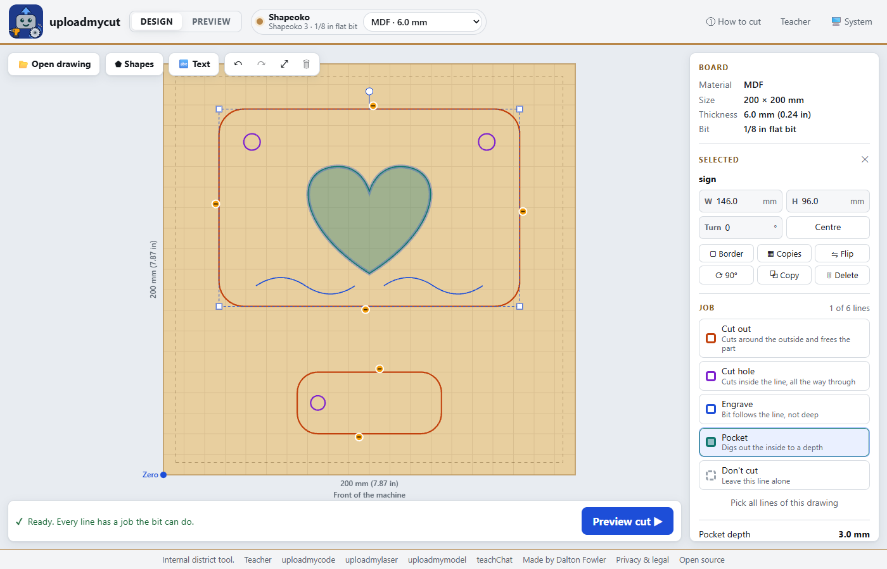
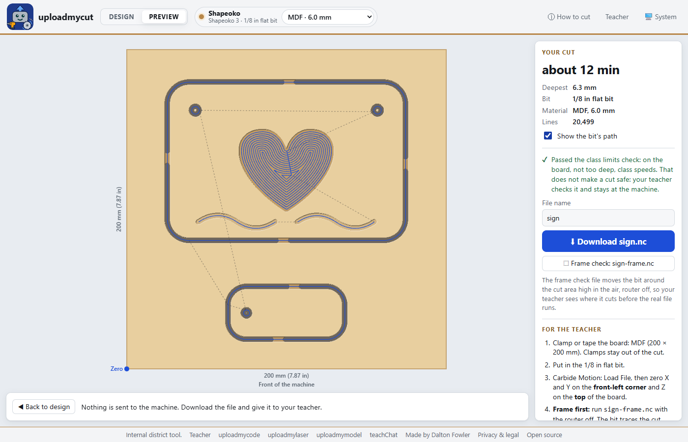
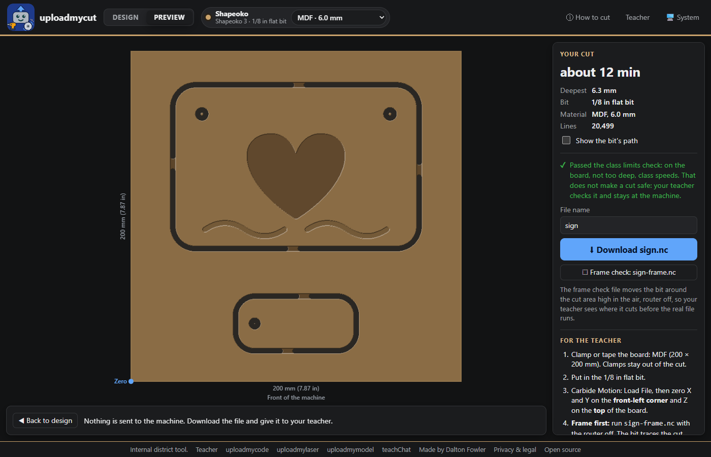

# uploadmycut

Classroom cut files for the Shapeoko CNC, with teacher-set limits, built for Chromebook classrooms. Students open
a drawing (SVG), pick a shape or a starter project, or type text; place it on the board; give each
line a job (cut out, cut hole, engrave, pocket); fix the red spots where the bit is too thick;
preview the carved board; and download a `.nc` file, plus a frame check file, for the teacher to
run in Carbide Motion. The bit, materials, speeds, depths, tabs and clamp zones come only from the
teacher's class setup. Internal district tool, sibling of
[uploadmycode](https://uploadmycode.com), [uploadmylaser](https://uploadmylaser.com) and
[uploadmymodel](https://uploadmymodel.com). Made by [Dalton Fowler](https://daltonjfowler.com).







**Status (2026-09-29):** live at [uploadmycut.com](https://uploadmycut.com). Feeds are starting
values, not yet tested on the school machine. See [PLAN.md](PLAN.md) and
[docs/HARDWARE.md](docs/HARDWARE.md).

All cutting maths runs in the browser. Nothing a student draws is sent to the server.

## What is in it

- **Student page** (`/`): SVG, shapes, starter projects (name keychain, door sign, star ornament)
  and text (block, script or stencil letters, straight or bent on a curve). Move, size, turn, flip,
  copy, and *Copies* for a class set in rows. Tabs are placed for you and can be dragged along the
  cut line. The design autosaves in the browser.
- **File check** on every download: the file must set millimetres and absolute moves first, stay
  on the board and under the safe height, keep low moves off the clamp areas, go no deeper than
  the board plus the cut-below depth, keep to the class speeds, and hold no machine settings, unlock, tool change or homing commands.
  It reduces mistakes; it does not make a cut safe.
- **Teacher page** (`/teacher/`): machine, router, the one class bit, materials with board size,
  speeds and clamp zones, which jobs students may use, cut rules, and a note to the class.
- **Teacher file check** (`/check/`): drop any `.nc` file to run the same check with the live class
  limits. The file stays on the teacher's computer.
- **USB test page** (`/usb-test/`): a read-only Web Serial check that asks the controller four
  questions and cannot move the machine. Sending a job over USB is not built yet.

V-carving with a second bit (a V-bit) is written but switched off, and not offered on the site yet.

Guides: [students](docs/STUDENT_GUIDE.md) · [teachers](docs/TEACHER_GUIDE.md) · [first cut checklist](docs/FIRST_CUT.md).

## Teacher key

The teacher page (`/teacher/`) needs the `TEACHER_KEY` Worker secret, the same shared password as
the sibling sites: `npx wrangler secret put TEACHER_KEY`. For local dev, put a throwaway key in
`.dev.vars` (gitignored).

## Commands

```sh
npm install
npm test              # unit tests: SVG reader, toolpaths, G-code, checker, settings
npm run dev           # build, then wrangler dev on http://127.0.0.1:8791
npm run test:browser  # browser tests against npm run dev (needs Chrome)
node test/browser/perf.test.mjs  # speed on a slow Chromebook (CPU 4x slower)
npm run icons         # redraw the icons into web/public
npm run deploy        # build and deploy
```

## Credits

Polygon offsets by [Clipper](https://github.com/junmer/clipper-lib) (Angus Johnson, Boost licence).
Fonts read with [opentype.js](https://github.com/opentypejs/opentype.js) (MIT). Fonts: Lilita One
(Juan Montoreano), Pacifico (The Pacifico Project Authors) and Allerta Stencil (Matt McInerney),
all SIL Open Font License 1.1,
licence files in `web/public/fonts/`.

## Trademarks and safety

Independent school project. Not affiliated with, made by, tested by or endorsed by Carbide 3D or
Makita. Shapeoko, Carbide Motion, Carbide Create and Makita are trademarks of their owners. The
site limits what students can change; it is not a safety system. See
[Privacy and legal](https://uploadmycut.com/legal.html).

## License

MIT, see [LICENSE](LICENSE). The fonts keep their own licence (OFL 1.1).
